# Ronin Echoes.

Enlace al proyecto: https://github.com/adriijg/proyecto-videojuego

Videojuego proyecto creado por **David Hoyas Navarro** y **Adrián Junquera Grueso**, utilizando la herramienta Godot, con la versión 4.6.1.

- **Género:** Plataformas de acción 2D (Hack 'n' Slash).
- **Mecánica Principal:** El jugador controla a un Samurai que debe atravesar niveles plagados de enemigos (esqueletos, duendes explosivos y ojos voladores) para recolectar fotos y avanzar.
- **Objetivo:** Llegar al mapa final sobreviviendo a los obstáculos y recolectando todos los coleccionables disponibles.

## Concepto.

Ronin Echoes es un juego de acción y aventura en 2D que sigue la historia de un samurai errante en su búsqueda por redimirse y encontrar su propósito.

El juego consiste en un mundo lleno de de desafíos y diferentes enemigos, donde el jugador debe utilizar sus habilidades de combate y estrategia para superar los diferentes obstáculos y avanzar en la historia.

Nuestro personaje poco a poco se irá encontrándose a si mismo hasta llegar al último cofre, el cual se encuentra en el templo del dragón, donde se encuentra el tesoro más valioso de todos, una foto de su hija fallecida.

Para poder soltar su carga, deberá ir recogiendo fragmentos de fotos por los diferentes niveles, los cuales se encuentran en cofres escondidos por el mundo. Cada fragmento de foto representa un recuerdo de su hija, y al recolectarlos, el samurai podrá ir reconstruyendo su historia y encontrar la paz interior que tanto busca.

## Arte.

- **Escenarios:** Utilización de TileSets para la creación de niveles, diferenciando capas de colisión (suelo y paredes) de capas puramente decorativas. Uso de Parallax Scrolling en múltiples capas para generar profundidad en los escenarios forestales y montañosos.

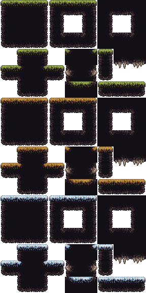

- **Interfaz (UI):** Menú principal minimalista y fuentes personalizadas para mejorar la inmersión.

- **Recursos:** Se han utilizado spritesheets para el Samurai y diversos enemigos, así como recursos de audio para la ambientación sonora.

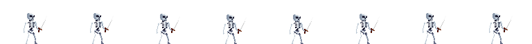
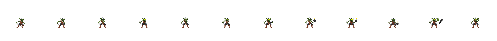
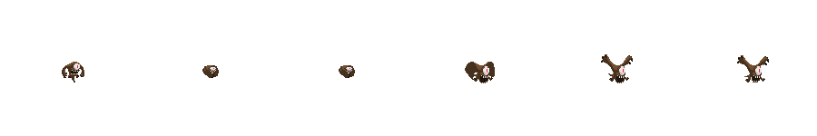

Ejemplo del último nivel del juego, cuando el Samurai ha vencido a todos los enemigos y vuelve a su hogar.

Cada nivel se diferencia por su estilo artístico, mostrando diferentes entornos a los que el jugador se enfrentará.

## Programación.

- ### Personaje y Movimiento.

    - CharacterBody2D: Control preciso del movimiento horizontal y salto.
    - Animaciones: Implementación de animaciones para caminar, atacar y morir, utilizando el sistema de animación de Godot.
    - Cámara: Seguimiento suave del personaje para mantenerlo centrado en la pantalla.

    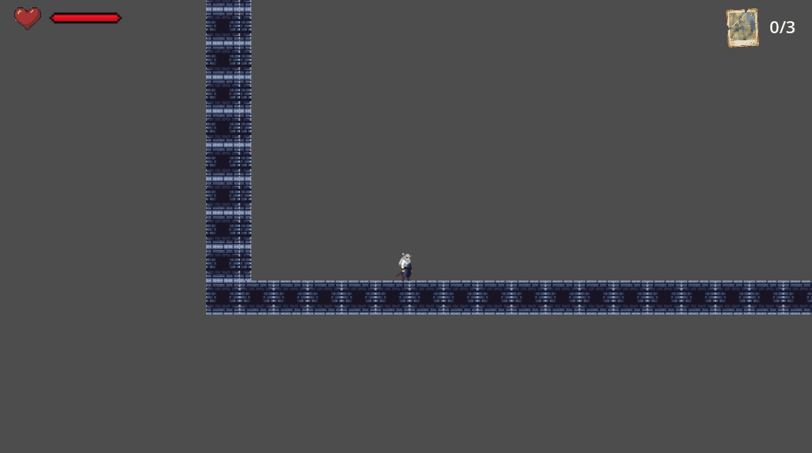

- ### Enemigos y Comportamiento.

    - Esqueletos: Enemigos básicos que patrullan áreas específicas.
    - Duendes Explosivos: Enemigos que se encargan de lanzar bombas explosivas al jugador.
    - Ojos Voladores: Enemigos aéreos que atacan desde el aire.
    - Pinchos: Obstáculos estáticos que dañan al jugador al contacto.

    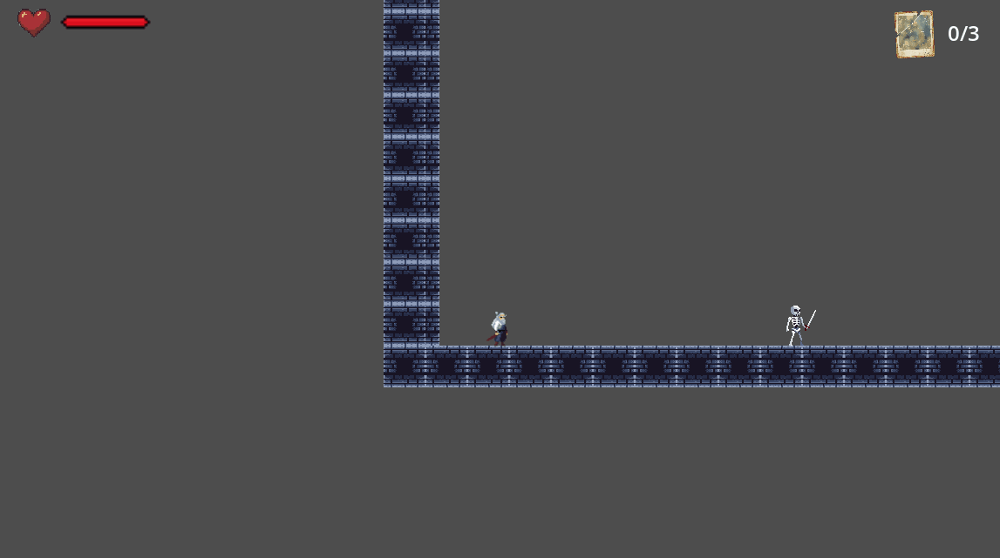
    
    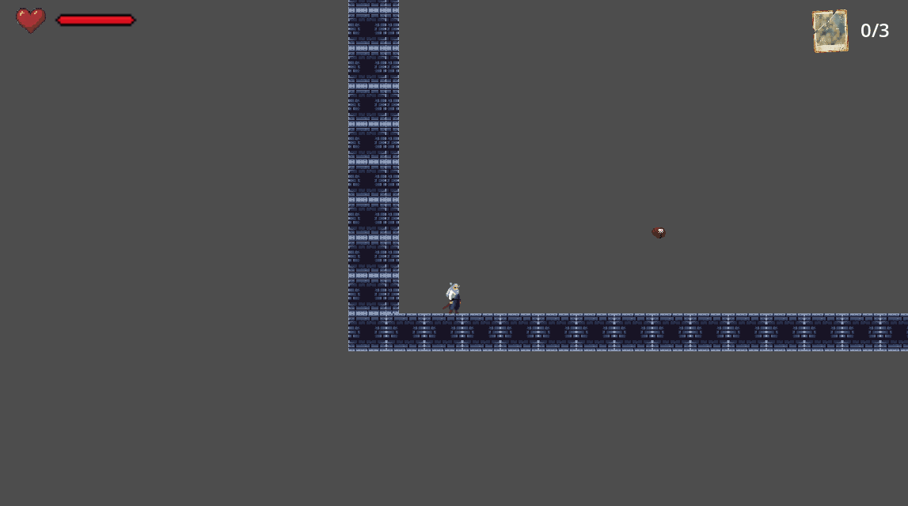
    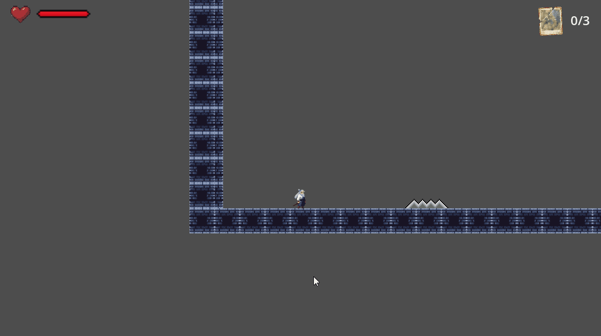

- ### Sistema de Hitbox Dinámicas.

    - Implementación de hitboxes para ataques y colisiones, ajustándose dinámicamente según la animación del personaje.

    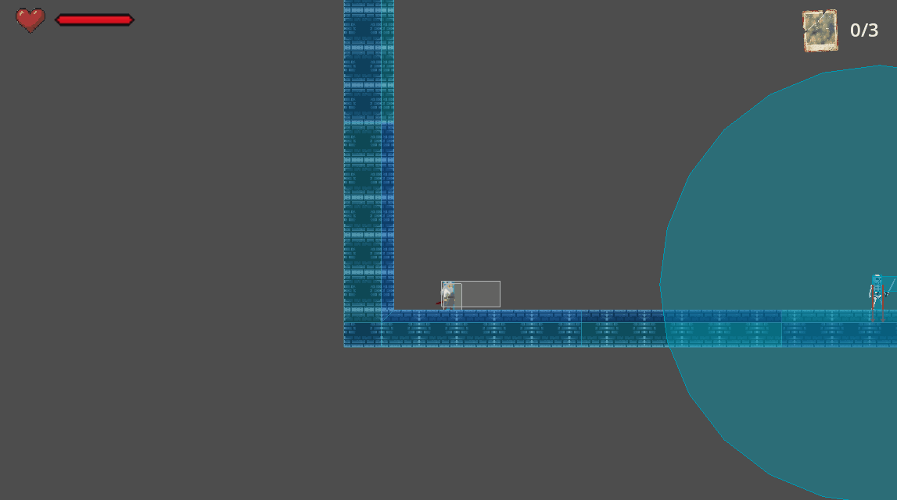

- ### Sistema de Checkpoints.

    - Implementación de puntos de control que permiten al jugador reiniciar desde el último checkpoint alcanzado tras morir.

    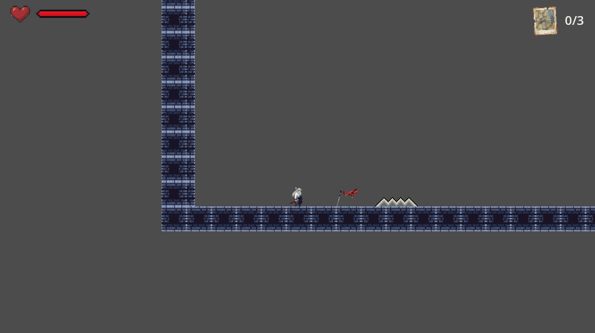

- ### Colleccionables y cofre.

    - Poción de vida: Objeto que el jugador puede recoger para restaurar su salud.

    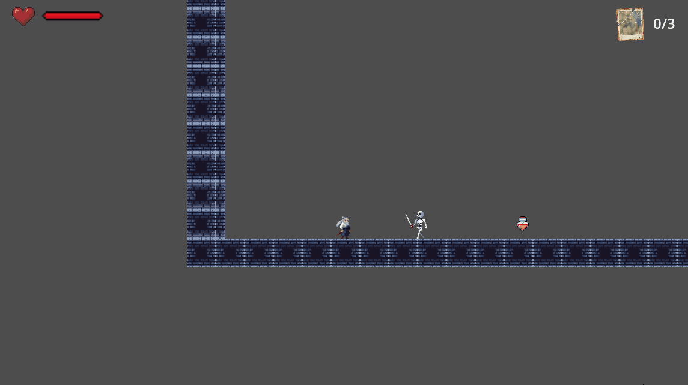

    - Fotos: Objetos coleccionables que el jugador debe recolectar para avanzar en la historia y abrir el cofre final.

    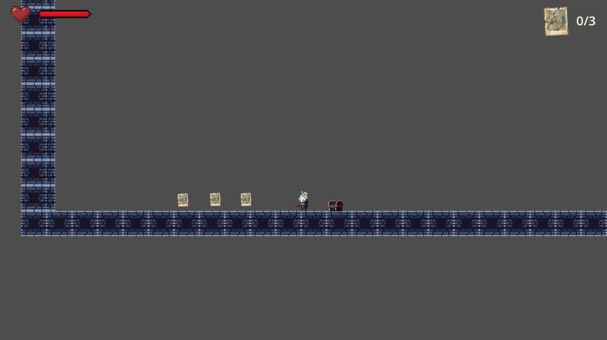

    - Cofre: Objeto interactivo que se desbloquea al recolectar todas las fotos, permitiendo al jugador moverse entre los diferentes niveles del juego.

    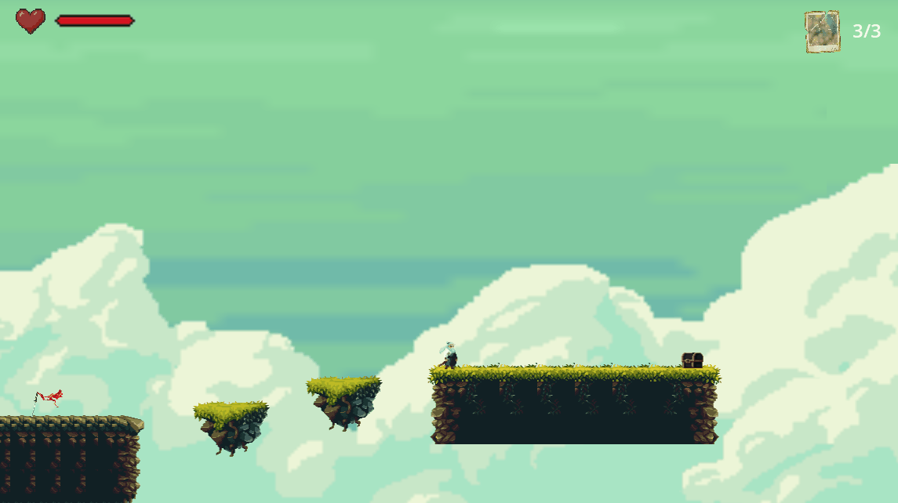

- ### Menu Principal y UI.

    - Diseño de un menú principal funcional con opciones para iniciar el juego, acceder a configuraciones y salir.
    - Implementación de una interfaz de usuario para mostrar la salud del jugador, el número de fotos recolectadas y otros elementos relevantes.

    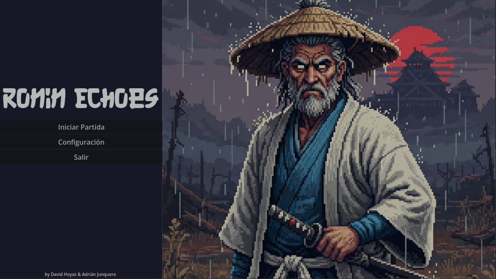
    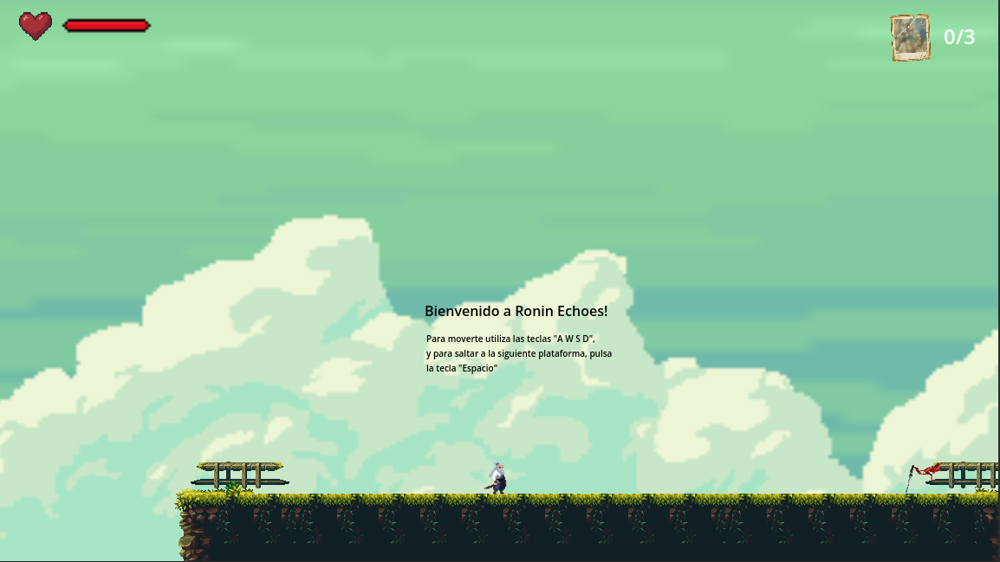
    - Barra de salud: Visualización clara de la salud del jugador, con cambios de color para indicar niveles críticos.

    
    - Contador de fotos: Indicador visual del progreso en la recolección de fotos

    

    - Menú de configuración: Muestra los diferentes controles del juego, permitiendo a los jugadores conocer las mecánicas básicas, tanto si juega con teclado como con mando.

    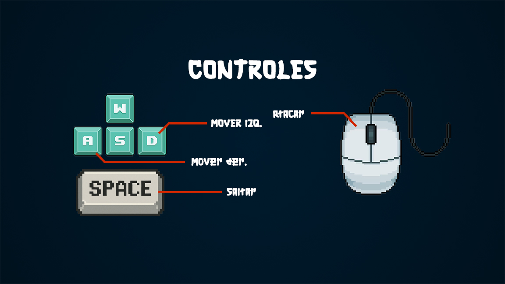
    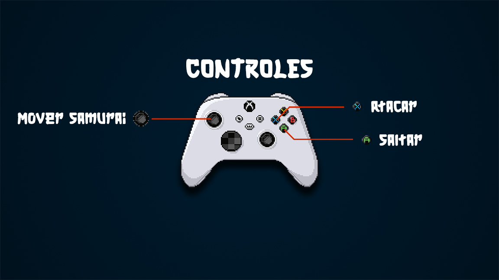

- ### Sistema de Audio.

    - Implementación de música de fondo y efectos de sonido para mejorar la inmersión del jugador.

- ## Elementos destacables del Desarrollo.

    - **Innovaciones Técnicas:** Se han implementado varias técnicas avanzadas de programación y diseño de juegos para mejorar la experiencia del jugador, como:

        - Control de Audio Dinámico: El juego ajusta automáticamente el volumen y la presencia de la música dependiendo de si el jugador se encuentra en el menú principal o en el tutorial, utilizando una lógica de decibelios por código.

        - Hitboxes Adaptativas: Las áreas de colisión de ataque no son estáticas; se activan y desactivan en fotogramas específicos de la animación para lograr una precisión total en el combate.

        - Sistema de Recolección y Progresión: El jugador debe recolectar fotos para avanzar, lo que añade una capa de exploración y motivación para completar el juego.

        - Persistencia de datos: Los fragmentos de fotos recolectados se gestionan en una variable global para asegurar que el progreso no se reinicie al transicionar entre escenas de niveles.

        - Sistema de muerte y reinicio: Al morir, el jugador es reiniciado al último punto de control alcanzado, manteniendo la progresión de fotos recolectadas.

    - **Problemas y Soluciones:**

        - Problema de los nodos huérfanos: Al morir un enemigo, el sonido desaparecía antes de terminar.

            - Solución: Se delegó la función al script Global y se implementó un await para retrasar el queue_free() hasta que el feedback visual y sonoro fuera satisfactorio.

        - Problema de la cámara: La cámara no seguía al jugador correctamente, causando una experiencia de juego frustrante.
            - Solución: Se ajustaron los parámetros de seguimiento de la cámara y se implementó un sistema de suavizado para mejorar la experiencia visual.

        - Problema de la recolección de fotos: Al cambiar de escena, el progreso de recolección de fotos se reiniciaba, lo que desmotivaba al jugador.
            - Solución: Se implementó una variable global para almacenar el progreso de recolección de fotos, asegurando que el progreso se mantuviera a través de las diferentes escenas del juego.

        - Problemas con la hitbox: Las hitboxes de ataque no se activaban correctamente, lo que resultaba en una experiencia de combate insatisfactoria.
            - Solución: Se implementó un sistema de hitboxes dinámicas que se activan y desactivan en fotogramas específicos de la animación, mejorando la precisión del combate.

        - Problemas con las animaciones: Las animaciones no se reproducían correctamente, lo que afectaba la fluidez del juego.
            - Solución: Se revisaron y ajustaron las animaciones para asegurar que se reprodujeran de manera fluida y coherente con las acciones del jugador.

## Conclusión.

Ronin Echoes es un proyecto ambicioso que combina elementos de acción, aventura y exploración en un entorno 2D. A través de la implementación de mecánicas de juego sólidas, un diseño artístico atractivo y una narrativa envolvente, el juego ofrece una experiencia única para los jugadores. A pesar de los desafíos técnicos enfrentados durante el desarrollo, se han implementado soluciones creativas para garantizar una experiencia de juego satisfactoria y coherente. En última instancia, Ronin Echoes busca ofrecer a los jugadores una aventura memorable llena de desafíos, emociones y descubrimientos. 

Proximamente se añadirá un sistema de combate más profundo, con nuevas habilidades y enemigos, así como una historia más elaborada para enriquecer la experiencia del jugador.
