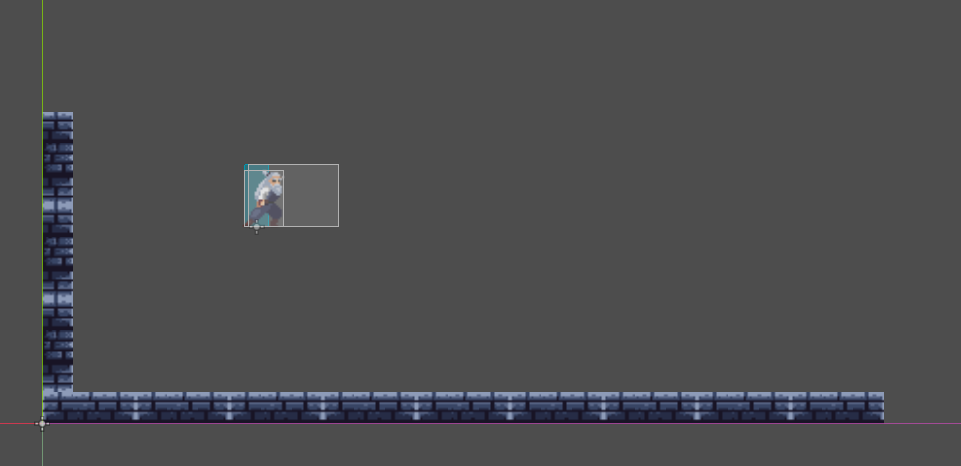
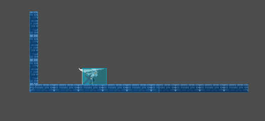
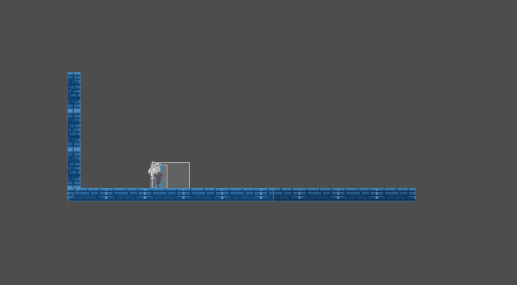

# Ronin Echoes.

### Concepto.

Ronin Echoes es un juego de acción y aventura en 2D que sigue la historia de un samurai errante en su búsqueda por redimirse y encontrar su propósito.

El juego consiste en un mundo lleno de de desafíos y diferentes enemigos, donde el jugador debe utilizar sus habilidades de combate y estrategia para superar los diferentes obstáculos y avanzar en la historia.

Nuestro personaje poco a poco se irá encontrándose a si mismo hasta llegar al último cofre, el cual se encuentra en el templo del dragón, donde se encuentra el tesoro más valioso de todos, una foto de su hija fallecida.

### Características.

Ejemplo de como la hitbox cambia según la animación del personaje, en este caso el samurai. En la imagen se puede ver como la hitbox se adapta a la posición del personaje, lo que permite una mejor detección de colisiones y una jugabilidad más fluida.

